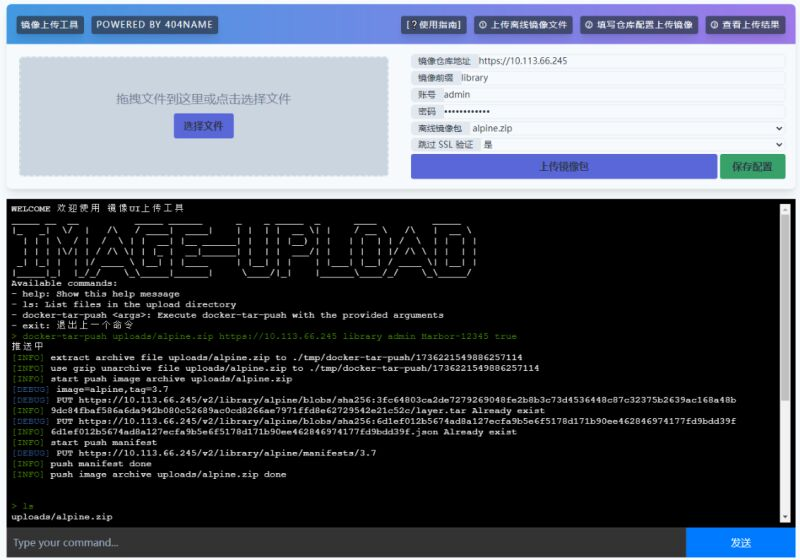

# 镜像UI上传工具 

image-upload-portal 解决部分场景无法使用命令行上传镜像的问题



# install

go mod tidy
go run ./ server

**实现热加载**
go get -u github.com/cosmtrek/air
air init
air

# docker-tar-push
push your docker tar archive image without docker

## 功能
- 支持gz格式的image
- 支持对image增加前缀repo
- 支持上传harbor


**用法一**  
```shell
docker-tar-push alpine:latest --registry=http://localhost:5000
```

**用法二**  
例如将 `docker save python:3.0 > python-3.10.tar` 镜像文件推送harbor仓库, 这时需要存放至 harbor仓库 library 项目中，使用下面参数 `--image-prefix=library/` 即可。   
```shell
docker-tar-push /镜像目录路径 --registry=http://harbor.harbor.svc --username=admin --password=Harbor12345 --image-prefix=library/
go run ./ docker-tar-push ./uploads/whoami.tar.gz --registry=https://10.113.66.245 --username=admin --password=Harbor-12345 --skip-ssl-verify=true --image-prefix=library/

docker-tar-push \uploads\image-upload-portal.rar https://10.113.66.245 admin Harbor-12345 library/
```
当我们从仓库下载镜像时，它的完整名称为: `docker pull harbor.harbor.svc/library/python:3.0`  

## 编译

```sh
go build -o bin/docker-tar-push cmd/docker-tar-push/main.go
```


# TODO

- [ ] dockerfile打包
- [ ] YAML适配
- [ ] 支持阿里云推送
